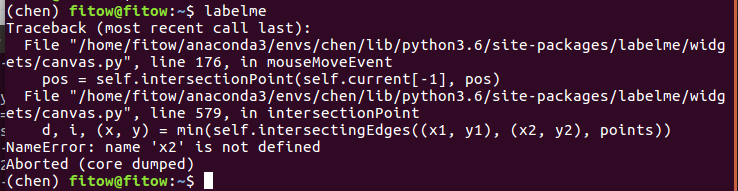

# labelme调试

## 安装

### Linux

### Windows

## 问题1

**错误信息：**



```
d, i, (x, y) = min(self.intersectingEdges((x1, y1), (x2, y2), points))
NameError: name 'x2' is not defined
```

**修改**

```
修改python3.6/site-packages/labelme/widgets/canvas.py
```

```python
# 修改intersectionPoint()
x1 = min(max(p1.x(), 0), size.width() - 1)
y1 = min(max(p1.y(), 0), size.height() - 1)

# 后增加

x2 = min(max(p2.x(), 0), size.width() - 1)
y2 = min(max(p2.y(), 0), size.height() - 1)

if x1 ==0 or x1 == size.width()-1 or y1 == 0 or y1 == size.height()-1:
    return QtCore.QPoint(x2, y2)
```
